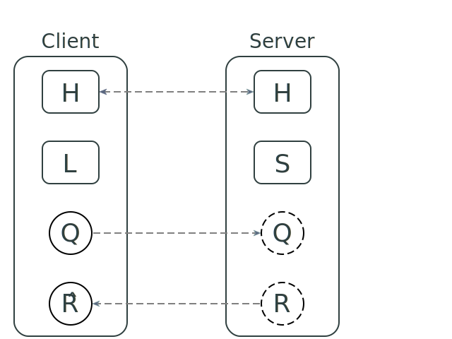

# Designing a network architecture/programming model for Cell

#### Warning: this document is only an early draft. It omits a large part of the proposed network programming model, and the discussion of the part that is described is still incomplete. No code is provided. Use your imagination to fill the gaps. For questions or feedback, either contact me directly at cell.lang.dev@gmail.com, or write in the <a href='https://groups.google.com/forum/#!forum/cell-lang'>forum</a>

### The problem

Implementing distributed applications is significantly more challenging than implementing equivalent local ones. Even trivial tasks like for instance sending data from the client to the server (or different servers) and vice-versa often ends up being very time-consuming, sometimes even requiring the developer to write the boilerplate code to serialize/deserialize the data that is being transferred, and in the worst cases to do so in more than one language, since the various network node may be written in different languages. And that's before the really difficult problems of building distributed applications are even considered.

### Goals

The programming model should hide to the maximum extent possible the fact that the application consists of different processes running on different machines. Ideally the developer would be able to write his or her code as if the entire distributed application where running inside a single process, and were written using a single language (that includes the query language, so no SQL or external database either).

The compiler should just reject code it cannot turn into an efficient distributed implementation, and should have a default strategy for dealing with issues (the most important of which being concurrency) that cannot be fully hidden from the developer, while at the same time providing the latter with the ability to override those strategies in the context of a specific application.

The programming model should be non-blocking and all network communication should be asynchronous and event-driven. Similarly, in the case of client/server systems the client should remain responsive and functional even when offline, or when the connection to the server is slow or unreliable. Obviously a client that cannot connect to the server will provide only limited functionalities, but those limitations should be defined the application logic itself, not by the programming model.

### Non-goals

In keeping with Cell's approach of integrating existing languages instead of replacing them, one non-goal is comprehensiveness, that is, the ability of the network model to implement all components of an application. The model is only designed to be used for those parts of an application where it's possible to improve on how things are done in conventional languages. Everything else will have to implemented in the host language, doing thing the usual way.

### Comparison with other distributed programming paradigms/models

The actor model as implemented, for example, in Erlang does not satisfy the above requirements. In Erlang the low-level mechanisms used to send a message from one network node to another are provided by the language and hidden from the developer and communication between nodes is indeed non-blocking, asynchronous and event-driven, but the developer is still expected to deal with all the issues that make building a distributed application more challenging than an equivalent local one: things like concurrency, network latency, communication failures, partial failures, data locality, scalability and so on. The behavior of the application depends heavily on the network and its behavior, and there's plenty of opportunity for developers to introduce bugs that have nothing to do with the abstract logic of their application but with the low-level concerns of its implementation.

An ideal network model, one that meets all the goals above, is map/reduce. With map/reduce the developer is only tasked with writing a couple of (conceptually, at least) pure functions, and the framework takes care of everything else. A specific computation will always produce the same result, independently of the specific network it is run on, and of anything (like network failures) that may happen during its execution. The developer cannot get the network logic wrong, simply because they don't need to concern themselves with it: all they need to write is the abstract computation logic.

The network programming models discussed here are aimed at stateful applications, which are more difficult to deal with than purely computational ones, so there's no expectation of obtaining the almost perfect separation of concerns between the abstract application logic and system-level issues that is achieved by map/reduce, but the latter remains the ideal model to aspire to.

### Basic principles and techniques

Most client/server applications store their persistent data into a single undifferentiated store (typically either an SQL or a NoSQL database), or at most a handful of them.

The proposed programming model(s) on the other hand will expect the developer to partition the application's persistent data (and more generally, all data that may be needed at more than one network node) into a variable (and unbound) number of smaller and cohesive clusters, each of which will be mapped to a relational automaton.

Having to deal with clusters of manageable size will make it possible to, among other things, automatically move and duplicate them across the network, which is obviously unfeasible if all persistent data is kept in a single centralized store.

The programming models will also rely heavily on the fact that Cell is a deterministic language where execution is repeatable, and that the same computation can be performed at different locations and times with the guarantee of obtaining always the same results, in order to keep different replicas of those automata synchronized. That will reduce the amount of data that needs to be transferred around the network and allow clients to work offline.

Persistence will be managed transparently by the architecture: the runtime will load automata from persistent storage whenever needed, evict them from memory after a period of inactivity, and make sure all updates are properly persisted. Cell's support for orthogonal persistence will be crucial in making this work. The developer will only need to declare which automata are meant to be persisted, and to provide a way to convert old data to the new format in the event of a schema change, if such conversion cannot be done automatically.

Some aspects of network programming can be taken care of automatically by the compiler or runtime, but others cannot. Among the latter, the most important one is concurrency. The network model will provide some default (but not particularly satisfactory) strategies for the simplest cases, but developer intervention will be required for more complex ones, or when those default strategies are inadequate. In particular, the developer will be expected in many cases to provide ways to reconcile divergent replicas of the same automaton instance. The fact that updates can only be triggered by messages, which are just pieces of data that can be manipulated programmatically will be crucial for this purpose, as will the ability to rewind the execution of a Cell program.

### Examples of client/server systems

The simplest case is when users of a given client/server application do not interact directly with one another, at least not in real time. An example could be an online retailer, or a single-player game that can nonetheless be played from multiple devices, which have to be kept synchronized. In all of these cases, it's natural to partition the global application state so that every cluster contains all the data that belongs to a single user. Such data could also be further split into a server-side component, a client-side one, and one that is shared between client and server.

Let's focus on the online retailer example. In that case this private user data could include not only a user's personal information, like name, addresses or payment information, but also their browsing history, purchase history, shopping cart and reviews.

Note that such data is not entirely "private" to the user it belongs to: a user's reviews, for example, are visible to any other end user of the website. But these other users don't need real-time access to it: a review could, for example, be made publicly available a few hours after it's been posted without really affecting the functionality of the website. Similarly, if a user edits later one of their reviews but the other users keep seeing a stale version for a little longer, nothing bad really happens.

The owner of the data is also not the only person who's ever allowed to update it: in the above example whenever a user places an order the shipping team, or the customer service team may also need to update the order's status or other information about it. Such updates though can be expected to be relatively infrequent, and the corresponding concurrency issues to be easy to manage.

The persistent data can be further split into a server side part and one that is shared between client and server: the latter could include things that are needed by the user interface, like the user name, the content of the shopping chart, the browsing history and open or recent orders, while the latter could include older orders, reviews or credit card information.

The clusters of data so identified will have the following characteristics:

  * Each cluster can be though of as belonging logically to a single customer, who will have unrestricted, read/write access to the most up-to-date version of it
  * Only a small number of users of the system will need real time read-only access to it. Other users may see a version of it that is updated only once in a while.
  * Other users of the system may be able to update it, but they are expected to do so infrequently enough that concurrency issues are manageable.

### A minimum viable architecture for client/server systems

We'll now examine more in detail the simplest possible case, the one where there's no or very limited real-time interaction between the users of the client/server application.

Each user's data will be stored separately, and split into three different clusters: a server-side part, a client-side one and a last one that is shared between the server and all the clients. Here's a picture of how such a system could look like, when focusing on a single user:

In the above image ***L***, ***H*** and ***S*** are relational automata containing the client-side, shared and server-side data respectively, and ***Q***, ***R*** and ***R&#770;*** are ordinary variables. The purpose of the former (that is, ***L***, ***H*** and ***S***) should be obvious, but the latter require some explanation.

The application code will be able to access only local data: code running on the server will have access to the data contained in ***S*** and ***H*** and code running on the client will be able to access ***L*** and ***H***. But the latter will also need to access pieces of data in ***S*** as well. It will be able to do so only indirectly, by setting the value of ***Q*** which in this architecture is basically a query object. Its value will be then copied asynchronously and automatically to the server. Once it's there, the system will compute ***R*** = ***r*** (***S***, ***H***, ***Q***) where ***r()*** is a (pure, referentially transparent) function provided by the developer, which will be then copied back (again, asynchronously and automatically) to the client and stored inside ***R&#770;*** . Between the time ***Q*** is set on the client and the output of the query is received, ***R&#770;*** will either be in an "undefined" state, or it will have a default value provided by the same piece of code that triggers the whole process by setting the value of ***Q***.

Extending the model to the case where there's more than one client-side or server-side or shared automaton or query object (for the same user) is trivial and will not be discussed here.

A user can also be accessing the application from more than one device, in which case the system would look more like this:

In this case the server contains an instance of ***Qi*** and ***Ri*** for each connected client device, but only a single instance of both ***H*** and ***S***. This second picture also shows the entry points for all the messages that can trigger an update of the system. Such messages can be sent to either the server or any of the clients. Note that they are always sent to the entire client or server block, not to any individual automaton.

### Equilibrium states

The above images depict the system in its equilibrium state. An equilibrium state is a state where the system doesn't need to take any action that affects its logical state, and is only waiting for a message to arrive. In order for such a system to be in an equilibrium state, a number of properties have to hold:

  * The various copies/instances of the automaton labelled ***H*** in the above images must all be in the same state.
  * All the ***Qi*** on the server must be synchronized with the master copies on each client.
  * ***R&#770;i*** = ***Ri*** = ***r*** (***S***, ***H***, ***Qi*** ) for each ***i***

### System behavior

In order to completely specify the behavior of the system, we need to define what happens when:

  * A new client connects for the first time.
  * What happens when a message is sent to the server
  * How a change to the state on the server is propagated to the clients
  * What happens when a message is sent to a client

### First connection

The first time a client connects to the system, it downloads the current state of ***H*** from the server and initializes the local copy of ***H*** with it. It initialized ***L*** and ***Q*** to some default state, which may depend on the state of ***H***.

### Message sent to the server

The corresponding message handler is invoked in order to update the state of the server block. The handler has full read access to ***S*** and the server copy of ***H***, but it's completely unaware of any client, and therefore cannot read ***Qi*** or ***Ri*** . It can mutate the state of ***S*** and ***H*** by sending them any number of messages.

After the handler returns and all updates on the server side have been committed, those state changes are propagated to the clients.

### Propagation of state changes from the server to the clients

Whenever the state of ***L*** on the server is mutated those mutations have to be propagated back to the clients. Since the state of a relational automaton can only mutated by sending it a message, and since the language is deterministic, all that is needed is to send the message(s) that caused the mutation to each of the clients, where they can be send to the local copies of ***H***.

Since the state of ***L*** and ***Q*** will, in general, be tightly coupled with the state of ***H*** in ways that depend on the logic of each specific application, and a change of state of the latter may invalidate the data held by the former, the only safe default strategy in this case is to reset the values of ***L*** and ***Q*** to the default value they would be set to if the client had just connected to the server. Note that resetting the state of ***L*** may, and generally will, involve a data loss.

In order to avoid such data loss, the developer will be able to provide a piece of code that specifies how the state of ***L*** and the value of ***Q*** have to be updated in response to ***H*** receiving the message.

Note that if a client comes back online after being disconnected from the server for some time, the above process may have to be repeated several times in order to go through the backlog of messages.

### Updates that are initiated by a message on the client

When a message is sent to one of the clients a corresponding message handler will be invoked. The handler will be able to:

  * read the state of ***L*** and send messages to it
  * read the state of ***H*** and send messages to it
  * read and set the value of ***Q***
  * read the value of ***R&#770;***
  * set a temporary/default value for ***R&#770;*** if and only if it also sets the value of ***Q***
  * send messages to ***S***

Note that the handler will be able to send messages to ***S***, but it won't be able to read its state.

All messages sent to ***S*** will be stored in a temporary buffer during the execution of the handler. Messages sent to ***H*** will be both executed locally and stored in the same buffer.

Once the message handler returns and all local updates have taken effect, the messages for ***S*** and ***H*** stored in the temporary buffer will be sent asynchronously to the server, without blocking the client. Once they've been transferred they will be sent to ***S*** and the server copy of ***H***.

If ***S*** is updated successfully on the server the client is notified and all updates are committed. If updating ***S*** fails, then all updates, on both the server and the client are rolled back. This process may be expensive on the client side, as it may involve starting from the last saved state and replaying all the already committed messages that have been sent since then.

***H*** does not pose any particular problem, because updates to it are run on the client side first, and are sent to the server only if they do not fail on the client.

After the server has been updated, updates are propagated to the other clients as described before.

### Concurrency issues

What we've said so far is enough to completely specify the behavior of the system in the absence of concurrency issues. In other words, we've assumed that the state changes produced by a message sent to either a client or the server have time to propagate through the entire system (that is, server and all clients) before a new message arrives at any of the network nodes. This is of course a completely unrealistic assumption, so we now need to specify what happens when two messages are sent concurrently to two different network nodes, before the update propagation process trigger by either of them has terminated.

More specifically, we need to be able to handle the following scenario: starting from an equilibrium state where both the client and sever copies of ***H*** are all in the same state ***H₀***, the server and one of the clients are simultaneously (or, more precisely, before either set of changes has time to propagate through the system) sent two different sequences of messages (***M*** and ***M'*** respectively) that cause their states to diverge. Providing a way to deal with this scenario is enough to completely specify the behavior of the system in all circumstances.

What we're dealing with here is the classic problem of reconciling divergent replicas of the same dataset. In our scenario, though, the two replicas won't be equivalent, since we'll be treating the server replica as the master one: any changes made to it will be final, and we won't be able to roll them back. So the first step of the reconciliation process will necessarily involve rolling back the state of the client replica of ***H*** to ***H₀***, and synchronizing its state with the server using the process described earlier.

Once that's done, we're left with the problem of deciding what to do with the sequence of messages ***M'*** that was sent to the client. We can just resend ***M'*** to ***H***, because the updates those messages were meant to trigger were meant for an older version of the data, and applying them to a different state does not, in general, make sense. So the only safe default course of action is to discard ***M'*** altogether, and to notify the user that any recent work has been lost. That's of course unacceptable in general, and especially so in the case of a client that has worked offline for some time, so there must a way for the developer to override this default behavior.

One way to do so it to have the developer provide a function ***r()*** that takes ***H₀***, ***M*** and ***M'*** as arguments, and returns a new edited list of messages that is meant to replace ***M'*** . It is up to ***r()*** to check whether there's any conflicts between the two sequences of messages ***M*** and ***M'*** , and take any corrective actions if deems necessary. ***r()*** could, for example, return an empty list, thereby silently discarding all the recent work done one the client side. It could just return ***M'*** if it detects no conflicts with ***M***, thereby doing the equivalent of rebase operation in a source code control system. Most of the time though, ***r()*** will need to check every message in ***M'*** to see if it conflicts with any of the messages in ***M***, and if that's the case replace such message/action with whatever seems most appropriate in the context of the application logic.

As an example, let's say you're building an online spreadsheet, where each message represents an editing operation that involves one or more cells in it. When going through each message ***m'*** in the ***M'*** list, the logic in ***r()*** would first check whether ***m'*** is trying to edit a cell that was updated by ***M***. If no conflict is detected ***m'*** could just be added to the list of messages returned by ***r()*** without any changes. Otherwise, ***m'*** would probably have to be replaced by one of more messages that flag the involved cell(s) so as to alert the end user to the conflict, and provide them with ways to reconcile the two sets of edits.

### More complex examples with real-time interaction between users

In more complex cases, users of the systems will have to interact with one another in real time. An example could be a chat application, or a multiplayer online game.

In the case of the chat application, the most natural way to partition the global application state is to create for each user a single cluster that holds all the information that can be naturally associated to them, like their name, email, preferences and list of chat groups they've joined, and to create another cluster for each chat group that contains the list of messages sent to it, and other information like for example the group's name. The clusters that contain a user's data will probably need to be shared between client and server, while the ones associated to a specific chat group could either be shared or kept only on the server side, in which case the client would still be able to send messages to the corresponding automata, but would access the data they contain only indirectly by using query objects of the type described before.

The chat group clusters could be further split in two, with one cluster containing only the most recent messages, and the other the entire chat group history, which could grow quite large as time goes by and the number of post grows. In this case, older posts would be periodically transferred from the latter to former, thereby keeping the latter from growing too large with time. That would make it easier to maintain different replicas of it on the server and each of the clients, should one choose to design the application that way.
